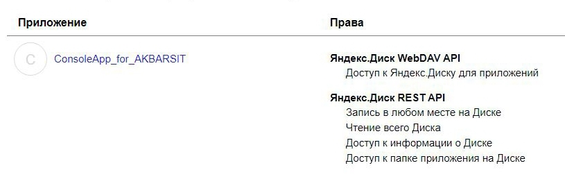
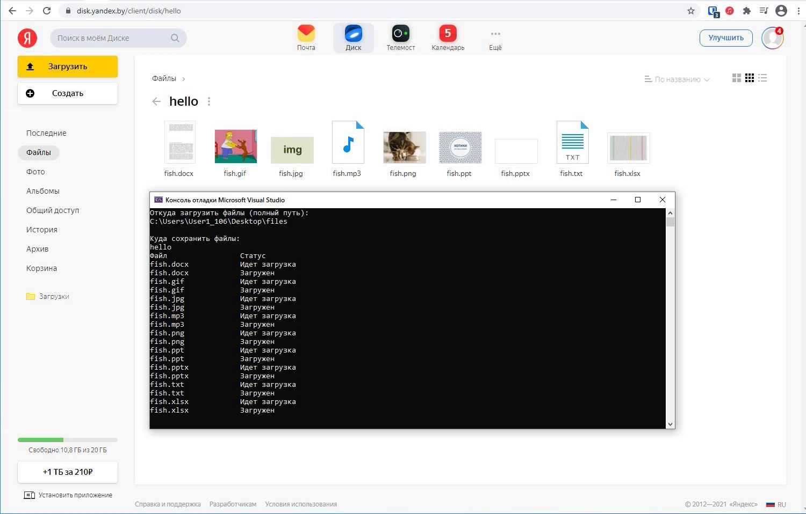

# ConsoleApp_for_YandexDiskAPI
Запрос путей для загрузки на яндекс.диск

## Задание
Консольное приложение, реализующее параллельную загрузку файлов из указанной директории 
(передается в качестве первого параметра консольного приложения) 
в указанную директорию в yandex disk 
(передается в качестве второго параметра консольного приложения):
API Yandex Disk:https://yandex.ru/dev/disk/poligon/# 

В процессе работы приложение должно отобразить список файлов и статус загрузки (загрузка/загружен).

## Регистрация в Яндекс OAuth

## Приложение, после запуска

